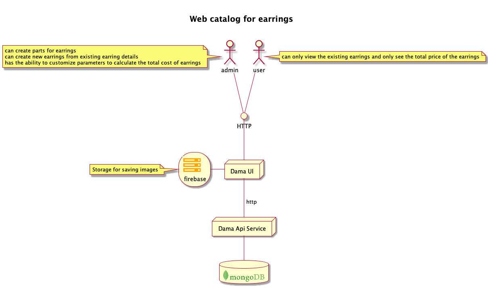
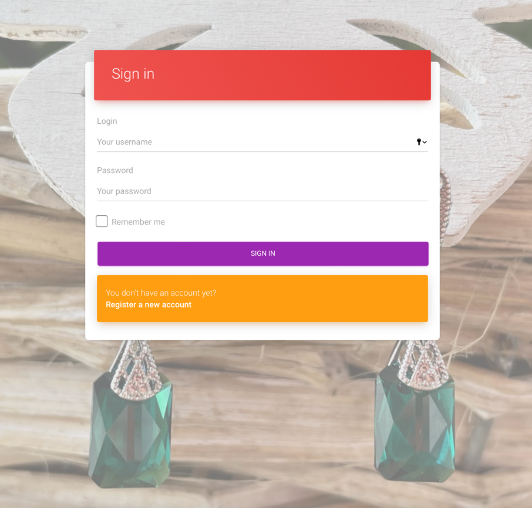

#  DAMA
## The web application  is a web catalog for earrings
[click here to visit the catalog](http://ec2-107-20-105-2.compute-1.amazonaws.com:8082) (username und password see table below)

### Diagram for Web application


### Technology Stack
|                       | Link to a project                                                                   |
|-----------------------|-------------------------------------------------------------------------------------|
| `Client - Frontend/UI` | more details [Dama UI](https://github.com/R-0-m-a/dama_ui#readme)                   |
| `Server - Backend`      | more details [Dama Api Service](https://github.com/R-0-m-a/dama_api_service#readme) |


Each user in the app will have a primary role and permissions to allow or deny access to content.

| Username        | Password   | Role                     | Permission                               |
|-----------------|------------|--------------------------|------------------------------------------|
| `user`          | `user`     | `ROLE_USER`              | can only read data                       |
| `admin`         | `admin`    | `ROLE_ADMIN`, `ROLE_USER`| can create, read, update, and delete data|

###### ROLE_ADMIN:
* can create parts for earrings. [Demonstration for creating a new earring detail](documents/DEMO_CREATE_DETAIL.md).
* can create new earrings from existing earring details. [Demonstration for creating a new earring](documents/DEMO_CREATE.md).
* has the ability to customize parameters to calculate the total cost of earrings (premium rate and delivery price). [Demonstration for configuration the price](documents/DEMO_PRICE_CONFIG.md).

###### ROLE_USER:
*  can only view the existing and only see the total price of the earrings. The price for earring details, premium rate and delivery price are hidden. [Demonstration for login as user](documents/DEMO_USER.md).


Also, possible to register a new user. [Demonstration of registration a new user](documents/DEMO_CREATE_NEW_USER.md).

## Docker. Deployment full web application with Mongo database

Go to directory `./docker`. File [.env](docker/.env) contains environment variables for the application. Edit the data as needed.
~~~txt
# Configuration for DB
DB_HOST=mongo

# Root user
DB_ROOT_USERNAME=admin
DB_ROOT_PASSWORD=admin1234

# Initialization DB for the application
DB_NAME=dama_db
DB_USER_NAME=dama
DB_USER_PASSWORD=damaTest

# Parameter for validation a token
JWT_SECRET=DemoTestDockerJWTforJavaDama2021secretEarringApplicationMilkaBelarussecretDeutschDublikateaDama2021secretEarringAppl

# Configuration for Logger
LOG_DIR=./logs
~~~

To deploy  web app run:

```
docker-compose up -d
```
Navigate to `http://localhost:8082/`.




